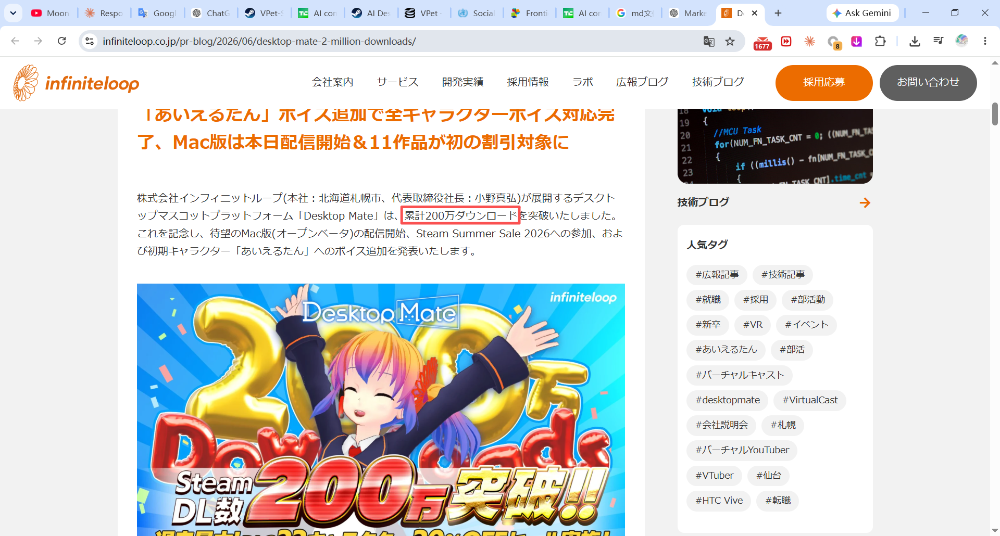
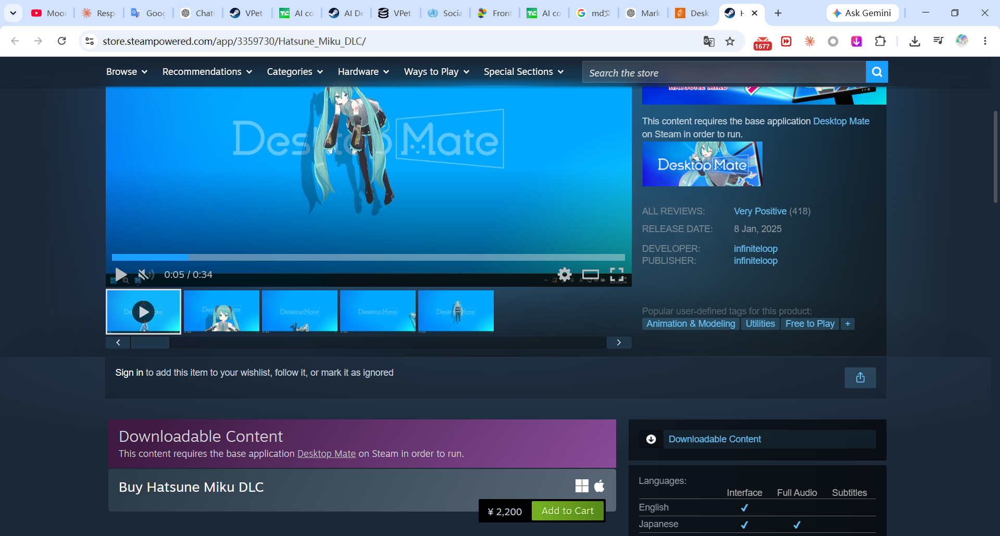
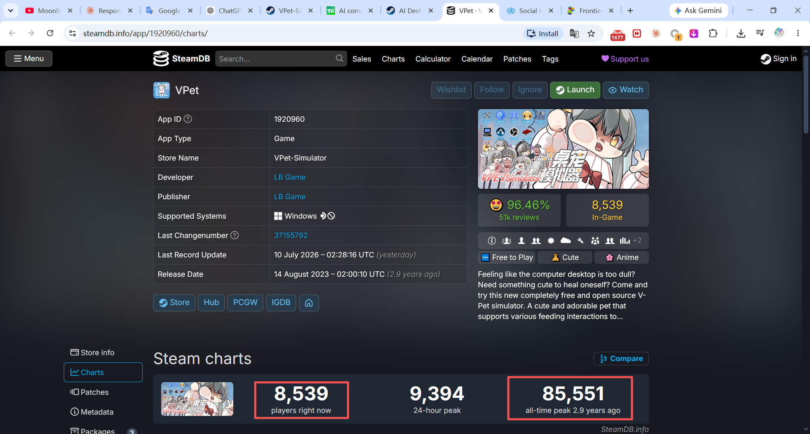

# Market Evidence: Guga AI Desktop Companion

This doc is just a quick intro to the feasibility and profit potential of a Guga desktop companion — and maybe, just maybe, it could become a future project , ill def complete the guga cursor-theme this weekend, cause it's faster and cheaper to make

## 1. Core of guga companion

what i believe guga app would be like:

> **Emotional-connection + cute chibi animations/interactions + AI tools**

**Emotional-connection:** It should be able to "understand" what users are doing in desktop, and give appropriatetalks/motions/interactions. e.g. when users arestruggling with their work like Progress Report, guga will says "Nice work today~", and remind users to take a break like every 45 minutes.

**cute chibi animations/interactions:** this is very important because "humans are visual animals"，and even though i haven't created a guga animation (def in the future), i think you can refer to the "Mutsumi" animation below:

    
  
  
  
  
  
  
  

> full animations/functions can refer to this link: https://github.com/yanhanruan/Mutsumi

**AI tools**: Including ai-chat (a real guga baby with her own characteristic instead of stiff gpt or gemini style response), long-term-memory (guga will remember user's preference, user owns a pet, its name is kitty, and user dislike americano) etc.

---

## 2. Consumers Already Pay for AI Companionship

Appfigures estimated that AI companion apps had generated **US$221 million by July 2025** ([TechCrunch, citing Appfigures](https://techcrunch.com/2025/08/12/ai-companion-apps-on-track-to-pull-in-120m-in-2025/)).

The same analysis reported that category revenue in 2025 to date was **64% higher than during the same period in 2024** ([TechCrunch, citing Appfigures](https://techcrunch.com/2025/08/12/ai-companion-apps-on-track-to-pull-in-120m-in-2025/)). About **33 AI companion apps had exceeded US$1 million in lifetime consumer spending** ([TechCrunch, citing Appfigures](https://techcrunch.com/2025/08/12/ai-companion-apps-on-track-to-pull-in-120m-in-2025/)).

People pay for digital companionship, and the market is crowded: the top **10% of apps generated 89% of category revenue** ([TechCrunch, citing Appfigures](https://techcrunch.com/2025/08/12/ai-companion-apps-on-track-to-pull-in-120m-in-2025/)). Demand is proven; standing out is the hard part. (guga's cute ofc and blowing up rn — give her the same features top apps have and it's over for everyone else)

---

## 3. Desktop Pets Already Sell at Scale

not a new concept btw — desktop pets already popping off

### Desktop Mate

The developer says Desktop Mate passed **two million cumulative downloads by June 2026** ([infiniteloop official announcement](https://www.infiniteloop.co.jp/pr-blog/2026/06/desktop-mate-2-million-downloads/)).

The product uses a free base application with paid licensed character DLC. Individual characters sell for **US$14.99** ([Steam: Hatsune Miku DLC](https://store.steampowered.com/app/3359730/Hatsune_Miku_DLC/)).

On the Steam page, the characters perch on your windows and react to the cursor, staying on screen while you work ([Desktop Mate on Steam](https://store.steampowered.com/app/3301060/Desktop_Mate/)).

Desktop Mate settles one question: a paid-character business can work. Whether Guga's will is a separate bet.

### VPet-Simulator

VPet-Simulator is free and open source, with feeding interactions, Steam Workshop support, and more than **200 types of animation** ([VPet-Simulator on Steam](https://store.steampowered.com/app/1920960/VPetSimulator/)).

As of July 2026, the Steam page showed **51,311 total user reviews**, of which **50,440 were positive** ([VPet-Simulator on Steam](https://store.steampowered.com/app/1920960/VPetSimulator/)). SteamDB recorded an all-time peak of **85,551 concurrent players** ([SteamDB](https://steamdb.info/app/1920960/charts/)).

**SteamDB concurrent-player peak: 85,551**

---

## 4. The Combined Opportunity

Guga sits where two working markets overlap. On the AI-companion side, people already pay for conversation, memory, voice, and a personality that carries over between sessions. On the desktop-pet side, they respond to a character that sits on their screen, reacting and animating, with room to customize it and drop in community-made content.

### Guga Product Thesis

Put the two together:

> One character that lives on your desktop, remembers you, and sounds like itself every time you open your laptop.

You are not paying for the sprite. You are paying for the **relationship layer** that sits on top of a character you like.

---

## 5. Potential Monetization Models

| Model | Structure | Supporting precedent |
|---|---|---|
| Free base app + paid character DLC | Free entry, characters sold separately | Desktop Mate characters listed at **US$14.99** ([source](https://store.steampowered.com/app/3359730/Hatsune_Miku_DLC/)) |
| One-time purchase | Pay once for the desktop companion | Common desktop-software model |
| AI subscription | Recurring fee for memory, voice, or cloud conversation | AI companion apps generated **US$221M cumulative spending by July 2025** ([source](https://techcrunch.com/2025/08/12/ai-companion-apps-on-track-to-pull-in-120m-in-2025/)) |
| Cosmetic packs | Outfits, voices, expressions, and animations | Character-DLC model demonstrated by Desktop Mate ([source](https://store.steampowered.com/dlc/3301060/Desktop_Mate/)) |
